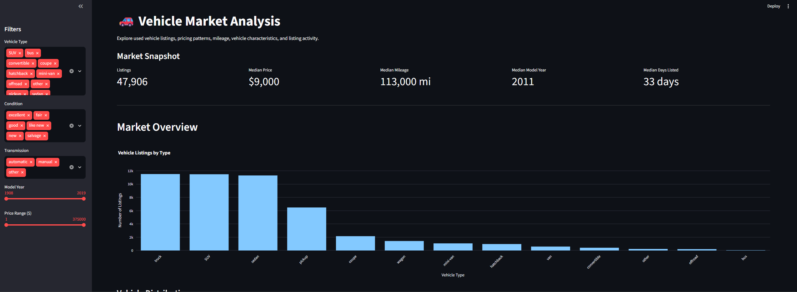

🚗 Vehicle Market Analysis Dashboard

An interactive data analysis dashboard built to explore used vehicle listings and uncover patterns in pricing, mileage, vehicle characteristics, and listing activity.

📌 Overview

This project analyzes a dataset containing **51,525 used vehicle listings**.

The goal was to transform raw vehicle listing data into an interactive dashboard that allows users to explore the market, identify pricing patterns, and investigate how characteristics such as mileage, model year, condition, and vehicle type relate to vehicle prices.

The dashboard was developed with **Python and Streamlit**, with data manipulation performed using **Pandas** and interactive visualizations created with **Plotly**.

🔗 Live Dashboard

✨ Key Features
• Dynamic KPIs
• Interactive filters
• Price & mileage analysis
• Vehicle characteristics
• Listing activity

💡 Key Insights
• Median price: $9,000
• Median mileage: 113,000 miles
• 75% listed ≤ 53 days
• Price distribution contains a strong upper tail

🛠 Tech Stack
Python | Pandas | Plotly | Streamlit | Jupyter

📁 Project Structure

Sprint_5_Project/
├── notebooks/
│   └── EDA.ipynb
├── streamlit/
│   └── config.toml
├── app.py
├── vehicles_us.csv
├── requirements.txt
└── README.md

🚀 Run Locally

git clone ...
pip install -r requirements.txt
streamlit run app.py

👤 Frederico Bonatti Buiatti e Espindola - Data Analyst